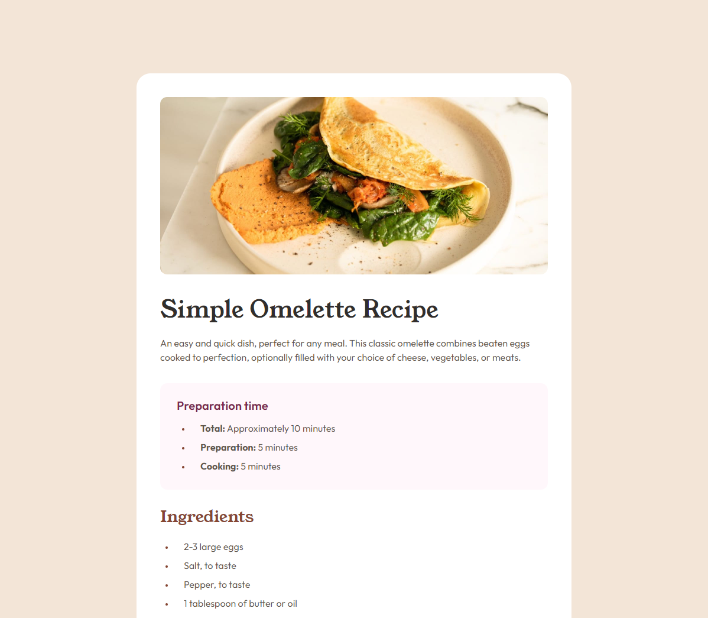

# Frontend Mentor - Recipe page solution

This is a solution to the [Recipe page challenge on Frontend Mentor](https://www.frontendmentor.io/challenges/recipe-page-KiTsR8QQKm).

### Links

- Solution URL: [GitHub](https://github.com/ImbaMaster/Recipe-Page)
- Live Site URL: [GitHub Page](https://imbamaster.github.io/Recipe-Page/)

### Built with

- Semantic HTML5 markup
- CSS custom properties
- Flexbox

### Author

- Frontend Mentor - [@ImbaMaster](https://www.frontendmentor.io/profile/ImbaMaster)
